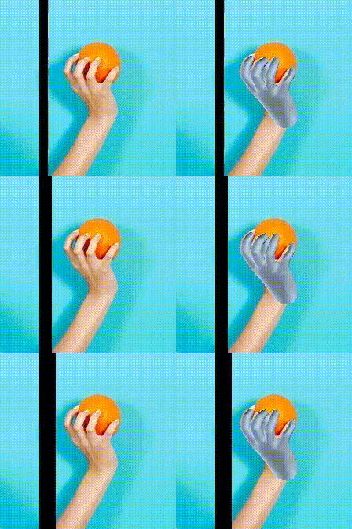
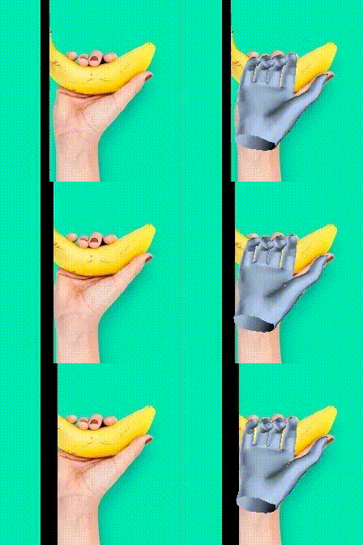
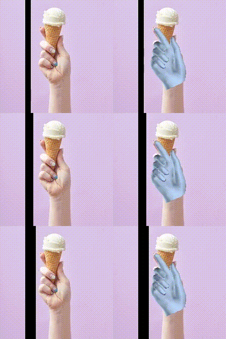
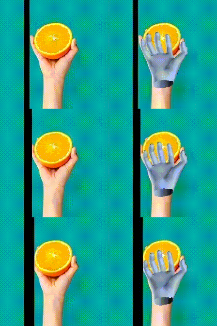
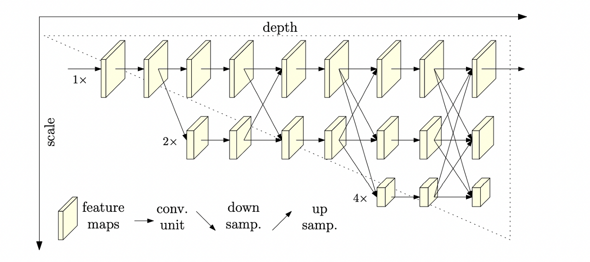
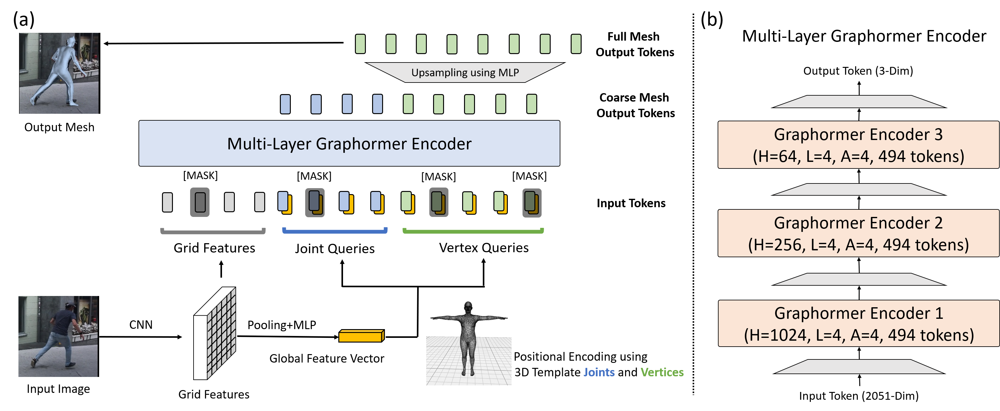

# ✨ Mesh Graphormer (ICCV 2021) ✨

## 제출자
이름 : 이정호 <br/>
학번 : 72210297 <br/>
학과 : 컴퓨터학과 <br/>
과정 : 석박사 통합과정 5학기 <br/>
지도교수: 최상일 교수 <br/>
구현 논문 링크: [Mesh Graphormer](https://arxiv.org/abs/2104.00272) </br>

      

  </br></br>

## 모델 설명
- 2D RGB 이미지를 입력으로 받아 3차원 hand pose coordinate를 출력으로 함
- 기존에는 2017년 처음으로 CNN 모델을 사용하여 3D hand pose estimation을 수행하였으며 그 이후 GCN를 활용하여 성능 향상을 시킴
- 해당 논문에서 처음으로 Transformer를 사용함
- 구조는 transformer encoder 3개를 이어 붙인 형태이며, 맨 마지막 encoder block에는 GCN을 사용
- Backbone network로 HRNet(CVPR 2019)을 사용함
- 위 모델은 일반적인 CNN의 layer를 거치면서 발생하는 feature map의 resolution 감소를 feature map의 resolution별로 병렬 연산 처리를 하여 문제점을 해결함으로써 Pose 분야에서 ResNet보다 우수한 성능을 보여 주로 pose 분야에서 주로 사용되는 모델임 </br></br>
- backbone인 hrnet의 출력은 여러 개의 resolution을 가진 feature map이 나오게 됨
- 해당 논문에서는 그 중 resolution이 젤 작은 7 x 7 feature map을 사용함
- Feature map을 가지고 transformer의 input으로 넣어줄 token을 만들어 주며, 2가지 컨셉으로 제작함
    - 첫번째로는 단순히 feature map을 flatten해주어 49개의 token을 만들어줌
    - 두번째로는 average pooling을 한 뒤, 21개로 복제함
    - 위 방법들로 총 70개의 token을 제작하였으며, 서로 다른 두 가지 방법으로 local & global 정보를 모두 포함했다고 저자들이 주장함
- Transformer encoder block 3개 중에 맨 마지막 block에만 GCN을 사용한 이유는 다양하게 GCN을 사용해 했을 때 맨 마지막 block에만 사용한 것이 가장 성능이 좋게 나왔기 때문임
- 최종 출력에서 여러 개의 token이 나오게 되며, 단순히 flateen 해서 만든 49개의 token은 grid로만 사용한 것이라 최종 출력에서는 사용하지 않고 21개의 token만을 가지고 upsampling을 하여 195개의 vertex coordinate를 얻어냄
- 한번에 195개의 vertex를 얻어내는 것보다 21개의 vertex를 얻어낸 뒤에 upsampling 하는 방식을 택함 (course-to-fine)
- 결론적으로, 2D RGB image를 넣어 backbone을 거쳐서 나온 7 x 7 feature map을 활용하여 70개의 token을 만들어 주어 transformer에 넣어주어 나온 70개의 token들 중 21개의 token이 3차원 pose coordinate가 됌

</br>
<p align = "center">
  </br>
 HRNet Overall Architecture (backbone)
</p></br>


<p align = "center">
 </br>
 Mesh Graphomer Overall Architecture
</p></br>

## Environment
- Python 3.8.10
- CUDA 11.7
- Ubuntu 20.04
</br></br>

## Setup with Conda
```bash
# Create a new environment
conda create --name gphmr python=3.7
conda activate gphmr

# Install Pytorch
conda install pytorch==1.4.0 torchvision==0.5.0 cudatoolkit=10.1 -c pytorch

export INSTALL_DIR=$PWD

# Install apex
cd $INSTALL_DIR
git clone https://github.com/NVIDIA/apex.git
cd apex
python setup.py install --cuda_ext --cpp_ext

# Install OpenDR
pip install matplotlib
pip install git+https://gitlab.eecs.umich.edu/ngv-python-modules/opendr.git

# Install MeshGraphormer
cd $INSTALL_DIR
git clone --recursive https://github.com/microsoft/MeshGraphormer.git
cd MeshGraphormer
python setup.py build develop

# Install requirements
pip install -r requirements.txt

# Install manopth
cd $INSTALL_DIR
cd MeshGraphormer
pip install ./manopth/.

```

## Download
```bash
cd $INSTALL_DIR
sh scripts/download_models.sh
wget https://datarelease.blob.core.windows.net/metro/datasets/freihand.tar
tar -xvf freihand.tar
wget https://psfiles.is.tuebingen.mpg.de/downloads/mano/mano_v1_2-zip
```

    ```
    ${INSTALL_DIR}  
    |-- models  
    |   |-- graphormer_release
    |   |   |-- graphormer_hand_state_dict.bin
    |   |-- hrnet
    |   |   |-- hrnetv2_w64_imagenet_pretrained.pth
    |   |   |-- cls_hrnet_w64_sgd_lr5e-2_wd1e-4_bs32_x100.yaml
    |-- freihand
    |   |-- train.yaml
    |   |-- test.yaml
    |-- src
    |   |-- modeling
    |   |   |-- data
    |   |   |   |-- MANO_RIGHT.pkl
    |-- README.md 
    |-- ... 
    |-- ... 
    ```

## 

## Train
``` bash
python src/tools/run_gphmer_handmesh.py
```
- 해당 코드를 실행하면, sample.png 이미지를 입력으로 받아 2D & 3D joint coordinate가 모델의 출력으로 나옴
</br></br>

## 주요 Code 분석
```bash
src/modeling/bert/e2e_hand_network.py
```
- 위 파일은 전체적인 모델의 구조를 나타냄
- 입력으로 받은 이미지를 backbone network에 넣어주어 image_feat, grid_feat로 나옴
- image_feat는 average pooling 적용한 뒤 21개로 값을 복사
- grid_feat는 7 x 7 feature map을 flatten
- 위 두 개를 concat해주어 70개의 token + 2048차원으로 만들어 70 x 2048 token 만듦
- 인코더에 넣고 출력으로 나온 70개의 token 중 image_feat에 해당하는 앞 21개의 token으로 3차원 pose coordinate를 MLP 통해서 얻어냄</br></br>

```bash
src/modeling/hrnet/hrnet_cls_net_gridfeat.py
```
- 위 파일은 backbone network에 해당하는 파일
- 입력 이미지가 들어가서 여러 개의 resolution을 가진 feature map들이 병렬로 연산이 수행됨
- 최종적으로, y_list라는 list에는 4개의 feature map들이 있으며 해당 feature map들의 크기는 아래와 같음
    - 7 x 7
    - 14 x 14
    - 28 x 28
    - 56 x 56
- 위 4개의 feature map 중에서 저자들은 7 x 7 feature map을 사용함 </br> </br>

```bash
src/modeling/bert/modeling_graphormer.py
```
- 위 파일에는 Encoder block에 들어가는 주요 내용들이 담긴 파일
- 흔히 사용하는 transformer encoder code </br> </br>

```bash
src/modeling/_gcnn.py
```
- 위 파일에는 마지막 encoder block에 들어가는 GCN에 관련된 내용들이 있는 파일
- Graph Convolution
- Graph Linear </br> </br>


## 모델의 주요 Pseudo Code

```bash
# Multi-Head Self-Attention
function MultiHeadSelfAttention(X):
    # h: the number of head (default 4)
    h = 4
    Q = X * WQ  # WQ, WK, WV: the weight of each Q, K, V
    K = X * WK
    V = X * WV
    Y = []
    for i = 1 to h do:
        Qi = SubspaceSplit(Q, i)
        Ki = SubspaceSplit(K, i)
        Vi = SubspaceSplit(V, i)
        Yi = Attention(Qi, Ki, Vi)
        Y.append(Yi)
    Y = Concatenate(Y)
    return Y

function SubspaceSplit(X, i):
    hd = X.shape[1] / h
    start_idx = (i - 1) * hd
    end_idx = i * hd
    return X[:, start_idx:end_idx]

function Attention(Q, K, V):
    scores = dot_product(Q, K.T) / sqrt(Q.shape[1])
    attention_weights = softmax(scores, axis=1)
    return dot_product(attention_weights, V)

```

```bash
# Graph Residual Block
function GraphConv(X):
    ## A: adjacency matrix (n x n)
    ## Y: the contextualized features (n x d)
    ## W: the trainable parameters
    Y = A * X * W  
    Y = activation_function(Y)  # use a ReLU
    return Y

function GraphLinear(X):
    ## b: bias
    Y = W * X + b 
    return Y

function GraphResidualBlock(X):

    Y = ReLU(X).T
    Y = GraphLinear(Y)

    Y = ReLU(Y)
    Y = GraphConv(Y)

    Y = ReLU(Y).T
    Y = GraphLinear(Y)
    Z = X + Y

    return Z
```


``` bash
# Overall Framework
# X: 2D RGB Image (h x w x 3)

# Backbone 모델을 통해 특징 맵 추출
X = backbone(X)  ## 7 x 7 x 2048 크기의 특징 맵

# 특징 맵을 평탄화해주어 Grid 형태로 변환
Grid_feat = Flatten(X)  ## 49 x 2048 크기의 토큰

# 특징 맵을 average pooling을 통해서 global 정보를 담고 있는 피쳐로 변환
Image_feat = Repeat(AveragePooling(X), 21)  ## 2048 크기의 토큰을 hand joint 개수인 21개로 복제해서 24 x 2048 크기의 토큰을 만듦

# Transformer-Encoder에 넣어줄 입력 token 
Input_token = Concatenate(Image_feat, Grid_feat)

# Transformer encoder 3개를 지나고 마지막 encoder에선 Graph Conv를 적용함
for j = 1 to 3 do:
    for i = 1 to 4 do:
        Input_token = MultiHeadSelfAttention(Input_token)
        if j = 3 do:
            Graph_token = GraphResidualBlock(Input_token[:21])
            Output_token = Concatenate(Graph_token, Input_token[21:]) ## Output_token: 70 x 64

Final_output = MLP(Output_token[:21]) ## 21 x 3의 hand joint coordinate를 구함

